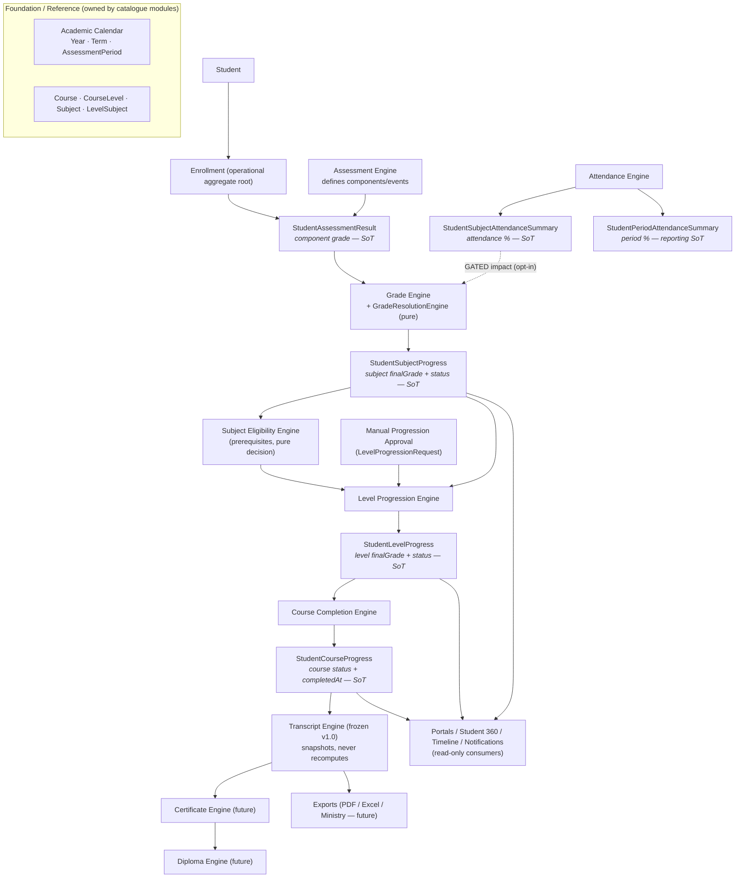
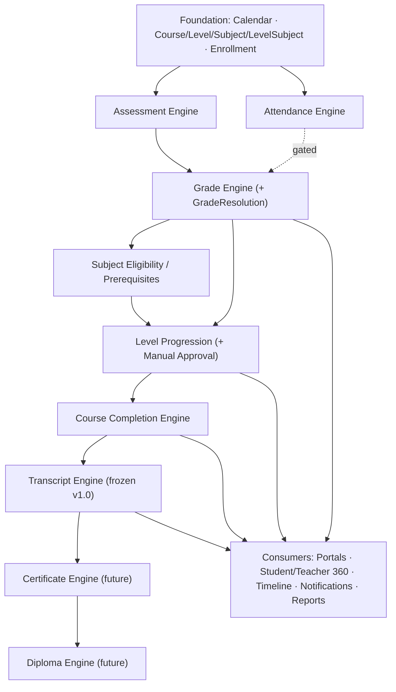

# Academic Core — System Design & Architecture

> **Read this before any individual engine document.** This is the highest-level
> architectural reference for the academic domain of the platform. It explains how every
> academic engine fits together as one system: responsibilities, boundaries, data flow,
> event flow, ownership, source-of-truth, lifecycle, dependencies, transaction boundaries,
> read models, audit, and observability.
>
> It **does not** duplicate lower-level engine documentation. Each engine has its own
> design doc (linked in §5). This document is the map; those are the territory.

**Status of this document:** architecture reference. No code, no schema. Terminology and
event names are grounded in the current codebase (`prisma/schema.prisma`,
`src/modules/**`, `src/server/**`) as of 2026-07-06.

**Companion documents (lower level — do not duplicate here):**
[grade-engine.md](grade-engine.md) ·
[assessment-engine.md](assessment-engine.md) ·
[attendance-engine.md](attendance-engine.md) ·
[attendance-engine-domain.md](attendance-engine-domain.md) ·
[academic-progression.md](academic-progression.md) ·
[course-completion-engine.md](course-completion-engine.md) ·
[academic-transcript-engine.md](academic-transcript-engine.md) ·
[academic-calendar.md](academic-calendar.md) ·
[domain-events.md](domain-events.md) ·
[auth-context.md](auth-context.md) ·
[teacher-access-scope.md](teacher-access-scope.md).

**Governance:** [ADR-001 — Academic Core Architecture Freeze v1.0](adr/ADR-001-academic-core-freeze.md).

---

## Academic Core Status

> **Freeze banner — authoritative.** This section records the architectural freeze of the
> Academic Core. The decision itself is recorded in
> [ADR-001 — Academic Core Architecture Freeze v1.0](adr/ADR-001-academic-core-freeze.md).
> Where older sections below still label the Transcript Engine as *designed* or *future*,
> the **Core Engine Status Matrix** here and ADR-001 are authoritative and supersede them.

- **Architecture Freeze:** YES
- **Freeze Version:** v1.0
- **Freeze Date:** 2026-07-07
- **Freeze Scope:**
  - Grade Engine
  - Recovery Lifecycle
  - Attendance Engine
  - Subject Eligibility Engine
  - Level Progression Engine
  - Course Completion Engine
  - Academic Transcript Engine
- **Rule:** All future academic features must **consume** the Academic Core. No future
  module may bypass or reimplement academic logic (grades, attendance interpretation,
  progression, completion, or official snapshots).

### Core Engine Status Matrix

| Engine | Architecture | Implementation | Tests | Production readiness | Official source document |
|---|---|---|---|---|---|
| Grade Engine | Frozen v1.0 | Implemented | Passing | Ready | [grade-engine.md](grade-engine.md) |
| Recovery Lifecycle | Frozen v1.0 | Implemented (within the grade cascade) | Passing | Ready | [grade-engine.md](grade-engine.md) |
| Attendance Engine | Frozen v1.0 | Implemented (phases 1–5) | Passing | Ready — academic impact gated off by default | [attendance-engine.md](attendance-engine.md) |
| Subject Eligibility Engine | Frozen v1.0 | Implemented | Passing | Ready | [academic-progression.md](academic-progression.md) |
| Level Progression Engine | Frozen v1.0 | Implemented | Passing | Ready | [academic-progression.md](academic-progression.md) |
| Course Completion Engine | Frozen v1.0 | Implemented | Passing | Ready | [course-completion-engine.md](course-completion-engine.md) |
| Academic Transcript Engine | Frozen v1.0 | Implemented (Phases 0–5) | Passing (198 module tests) | Ready — Phase 5 lifecycle closed; Phase 6 portal/export pending | [academic-transcript-engine.md](academic-transcript-engine.md) |

Legend: *Frozen v1.0* = architecture is closed and governed by ADR-001; any structural
change requires a new ADR (§21).

---

## Table of Contents

0. Academic Core Status (freeze banner + Core Engine Status Matrix)
1. Purpose
2. Academic Core vision
3. Domain principles
   - 3.1 Architectural dependency rules
4. Complete domain map
5. Engine catalog
6. Source-of-truth matrix
7. Data flow
8. Event flow
9. Transaction boundaries
10. Read models
11. Aggregates
12. Module dependencies
13. Lifecycle
14. Security model
15. Audit model
16. Observability
17. Performance model
18. Implementation order
19. Current status
20. Future roadmap
21. Architectural rules
22. How to use this document

---

## 1. Purpose

The Academic Core is the set of engines and data that manage a student's entire academic
journey — from the raw grading of an assessment to the official, certified record of a
completed course. This document is the **entry point** to that domain.

A new senior engineer should be able to read this once and understand: what each engine
owns, who is allowed to compute what, how a change to a single grade ripples through the
system, where transactions begin and end, and which rules are non-negotiable. After
reading this, they read the specific engine docs in §5.

---

## 2. Academic Core Vision

### 2.1 Responsibility

The Academic Core answers one question authoritatively and repeatably:

> **"What is this student's academic state, and how did it get there?"**

It turns operational activity (attending sessions, being graded on assessments) into
**derived academic state** (subject/level/course status and grades), and eventually into
**official records** (transcripts, and — in future — certificates and diplomas). Every
derivation has exactly one owner and one source of truth.

### 2.2 What belongs INSIDE the Academic Core

- Grading of assessment components and resolution of subject final grades.
- Attendance measurement and its (gated) academic impact.
- Subject, level, and course **progress state** and their transitions.
- Eligibility and prerequisite evaluation, recovery lifecycle, level progression, and
  course completion.
- Official academic records (Transcript now designed; Certificates/Diplomas future).
- The academic reference structure: courses, levels, subjects, level-subjects, and the
  academic calendar (years / terms / assessment periods).

**Examples (inside):** "Compute the final grade of *Physics* from its components." ·
"Decide whether the student passed Level 2." · "Freeze an official transcript version."

### 2.3 What belongs OUTSIDE the Academic Core

- **Finance** (invoices, payments, wallets, refunds) — a separate domain with its own
  audit trail (`financialAuditLog`). Course completion may *read* nothing from finance;
  certificate issuance may later *consult* financial clearance but never computes it.
- **Scheduling / class groups / classrooms / lessons** — operational inputs that *feed*
  attendance and assessments but are not academic-state owners.
- **Notifications, timeline, CRM, portals** — **consumers** of academic events and
  read-models. They never compute academic state.
- **Identity / auth / RBAC** — cross-cutting infrastructure the Core depends on, not part
  of the academic domain itself.

**Examples (outside):** "Send an email when a student passes." (Notifications, a consumer)
· "Book a classroom." (Operational) · "Charge a late fee." (Finance).

---

## 3. Domain Principles

Every principle below is load-bearing; violating one creates a class of bugs.

| Principle | What it means | Why it exists |
|---|---|---|
| **Single Source of Truth** | Each academic concept has exactly one owning engine/table (§6). | Prevents divergent answers to the same question. |
| **No duplicated calculations** | A number is computed once, by its owner, and copied — never recomputed by a consumer. | Two implementations of "final grade" will drift. |
| **Event-driven updates** | State changes emit transition events; downstream reacts to events, not polling. | Decouples engines; enables projections and notifications without coupling. |
| **Transactional consistency** | A mutation and all its cascaded state changes commit atomically in one `db.$transaction`. | A half-applied cascade would leave the student in an impossible state. |
| **Append-only history** | Audit and domain-event logs are never updated or deleted. | Academic decisions must be reconstructable and defensible. |
| **Snapshot over recalculation** | Official documents (transcripts) freeze facts; they never recompute from live data. | A document reissued a year later must read the same. |
| **Versioned official documents** | Corrections create new immutable versions; issued versions are frozen. | Legal/academic integrity of records. |
| **Read-model separation** | Expensive-to-derive facts are materialised into disposable projections (attendance summaries). | Fast reads without recomputing on every page load. |
| **Aggregate boundaries** | Writes go through an aggregate root (Enrollment, Assessment, …); cross-aggregate links are by id. | Keeps invariants local and transactions small. |
| **Tenant isolation** | Every query is scoped by `organizationId`; ids never cross tenants. | Multi-tenant safety. |
| **RBAC everywhere** | Every mutation authorizes on the server via CASL abilities; default deny. | The UI is never trusted. |
| **Transition-only signals** | Events and academic audit fire only on *real* state changes, not on every recompute. | Avoids event storms and noise; makes staleness detection meaningful. |

### 3.1 Architectural Dependency Rules

The dependency graph (§12) expressed as a **verifiable rule table** — the form to check
against during code review. It reads top-to-bottom in the source-of-truth order (§6):
each engine may depend on the layers above it and **must never** depend on the layers
below it. A violation is a design defect (§21), not a preference.

| Engine | May depend on (reads / calls) | Must never depend on |
|---|---|---|
| **Grade Engine** | Assessment Engine · `StudentAssessmentResult` · `LevelSubject` thresholds | Transcript · Certificate · Diploma |
| **Attendance Engine** | its own attendance records/sessions/policies | Grade Engine (to *compute* grades) · Transcript · Certificate |
| **Subject Eligibility** | `StudentSubjectProgress` · prerequisite rules/waivers | Transcript · Certificate · Diploma |
| **Level Progression** (+ Manual Approval) | `StudentSubjectProgress` · Subject Eligibility · `StudentLevelProgress` | Transcript · Certificate · Diploma |
| **Course Completion** | `StudentLevelProgress` · `StudentCourseProgress` | Transcript · Certificate · Diploma |
| **Transcript Engine** | **all academic engines' outputs, read-only** (progress + attendance summaries + assessment results + identity) | **no engine may depend on it** — it is a terminal reader |
| **Certificate Engine** (future) | issued Transcript versions | Grade Engine (or any Core engine) **directly** — it reads the Transcript, never live state |
| **Diploma Engine** (future) | Certificate Engine · Transcript | Grade Engine (or any Core engine) **directly** |

**Two rules that make this enforceable:**

1. **Downward-only.** If module A appears *below* module B in the table, B must never
   import, call, or subscribe-to-mutate A. Transcript/Certificate/Diploma are the terminal
   readers — nothing upstream may depend on them, which is what guarantees the Core has no
   cycles (§12).
2. **No direct-state shortcut for official records.** Certificate and Diploma read the
   **Transcript snapshot**, never the live grade/progress state directly. Reaching past the
   Transcript into the Grade Engine to "get the real grade" is the most tempting violation
   and is explicitly forbidden — it would bypass the immutable, versioned record.

Practical code-review check: *"Does this import/call point downward in the table?"* If yes,
reject it.

---

## 4. Complete Domain Map

The academic pipeline, top to bottom, with ownership boundaries. Solid arrows are data
derivation; each box names the **owner** of the state it produces.



**Reading the map:** the *cascade spine* is `StudentAssessmentResult → StudentSubjectProgress
→ StudentLevelProgress → StudentCourseProgress`, orchestrated in one transaction by the
grades **subject-progress cascade** (`src/modules/grades/services/subject-progress-cascade.service.ts`).
Everything below `StudentCourseProgress` (Transcript → Certificate → Diploma) **consumes**
that state and never writes back up the chain.

---

## 5. Engine Catalog

For each engine: purpose · owner (code location) · input · output · source of truth · side
effects · consumers · status. Detailed behaviour lives in the linked docs — this is the
one-screen summary.

### 5.1 Assessment Engine — `src/modules/assessments/`
- **Purpose:** define assessment policies, components, and scheduled assessment events; capture participation results.
- **Input:** teacher/secretary actions; class-group/subject structure; academic calendar.
- **Output:** `Assessment`, `AssessmentComponent`, `AssessmentPolicy`, participation `AssessmentResult` (sidecar — **grade values here are deprecated**).
- **Source of truth:** assessment *definitions* and participation/publication state.
- **Side effects:** emits `assessment.results_published`.
- **Consumers:** Grade Engine (reads components/events), portals.
- **Status:** Implemented. See [assessment-engine.md](assessment-engine.md).

### 5.2 Grade Engine — `src/modules/grades/`
- **Purpose:** grade assessment components and resolve subject final grades; drive the subject→level→course cascade.
- **Input:** `StudentAssessmentResult` component grades; `LevelSubject` thresholds; (gated) attendance.
- **Output:** writes `StudentAssessmentResult` (component grade = **SoT**) and `StudentSubjectProgress.finalGrade`/`status`.
- **Source of truth:** **component grade** (`StudentAssessmentResult`) and **subject final grade + status** (`StudentSubjectProgress`).
- **Side effects:** `student_subject.passed` / `student_subject.failed` (on transition); audit `grade.*`; triggers the cascade.
- **Consumers:** Eligibility, Level Progression, portals, (future) Transcript.
- **Status:** Implemented. See [grade-engine.md](grade-engine.md).

### 5.3 Grade Resolution Engine — `src/modules/grades/engines/grade-resolution.engine.ts`
- **Purpose:** pure, I/O-free class that resolves a subject's final grade from its weighted components (strategy-based).
- **Input:** component grades + weights + strategy.
- **Output:** a resolved final grade (returned value, not persisted by itself).
- **Source of truth:** none — it is a **calculator**, the Grade Engine persists its result.
- **Side effects:** none (pure).
- **Consumers:** Grade Engine only.
- **Status:** Implemented (unit-tested pure logic).

### 5.4 Attendance Engine — `src/modules/attendance/`
- **Purpose:** measure attendance and maintain persisted subject/period summaries; optionally (gated) feed academic progress.
- **Input:** `AttendanceRecord`, `AttendanceSession`, justifications, `AttendancePolicy` interpretation knobs.
- **Output:** `StudentSubjectAttendanceSummary` (**attendance % = SoT**), `StudentPeriodAttendanceSummary` (reporting SoT).
- **Source of truth:** attendance percentages and attendance status.
- **Side effects:** `attendance.summary_recalculated`, risk/threshold transition events, and — only when `AttendancePolicy.enforceAttendanceForProgress = true` — `attendance.subject_marked_incomplete` / `attendance.subject_recovered_from_incomplete` and the gated feed into the grade cascade.
- **Consumers:** Grade cascade (gated), portals, reports, (future) risk analytics.
- **Status:** Implemented (phases 1–5); alerts/reporting surface partly remaining. See [attendance-engine.md](attendance-engine.md), [attendance-engine-domain.md](attendance-engine-domain.md).
- **Critical boundary:** the **threshold** lives on `LevelSubject.minimumAttendancePercentage`; the policy flag only *enables enforcement*. Off by default → attendance is reporting-only and behaviour-neutral.

### 5.5 Subject Eligibility Engine — `src/modules/prerequisites/engines/subject-eligibility.engine.ts`
- **Purpose:** decide whether a student may take / progress in a subject given prerequisites and waivers.
- **Input:** `StudentSubjectProgress`, prerequisite groups/items, waivers.
- **Output:** an eligibility **decision** (pure); it does not own a persisted status column.
- **Source of truth:** the prerequisite *rules*; the decision is derived, not stored as a new SoT.
- **Side effects:** none directly (consumed by progression).
- **Consumers:** Level Progression Engine, UI eligibility panels.
- **Status:** Implemented. See [academic-progression.md](academic-progression.md).

### 5.6 Recovery Lifecycle — part of Grade Engine + `AssessmentRetake`
- **Purpose:** manage the *RECOVERY_REQUIRED → recovered / failed-after-recovery* path for subjects.
- **Note:** this is **not a standalone engine module**. It is a lifecycle expressed by `StudentSubjectProgress.status = RECOVERY_REQUIRED`, the `AssessmentRetake` model, `StudentAssessmentResult.sourceType = RECOVERY`, and audit actions `student_subject_progress.recovery_required` / `.recovered` / `.failed_after_recovery`, all driven through the Grade Engine's subject-progress cascade.
- **Source of truth:** still `StudentSubjectProgress` (owned by Grade Engine).
- **Status:** Implemented as part of the grade cascade.

### 5.7 Level Progression Engine — `src/modules/prerequisites/engines/level-progression.engine.ts`
- **Purpose:** decide level pass/fail/eligibility and promote a student to the next level.
- **Input:** subject progress for the level, eligibility decisions, level rules.
- **Output:** `StudentLevelProgress.finalGrade`/`status` (**SoT**); promotion updates `Enrollment.currentLevelId`.
- **Source of truth:** **level final grade + status**.
- **Side effects:** audit `level_progression.approved` / `.blocked` *(audit-only today — see §8)*.
- **Consumers:** Course Completion Engine, portals.
- **Status:** Implemented.

### 5.8 Manual Progression Approval — `src/modules/prerequisites/` (LevelProgressionRequest)
- **Purpose:** human review queue to approve/reject a level progression that isn't automatic.
- **Input:** a `LevelProgressionRequest`, reviewer decision.
- **Output:** transactional approve/reject that drives Level Progression; audit `level_progression_request.*`.
- **Source of truth:** the request's workflow state.
- **Consumers:** Level Progression Engine.
- **Status:** Implemented (2026-07-01). See [academic-progression.md](academic-progression.md).

### 5.9 Course Completion Engine — `src/modules/prerequisites/engines/course-completion.engine.ts`
- **Purpose:** decide and persist course completion; the terminal academic-state engine.
- **Input:** level progress across the course, completion strategy.
- **Output:** `StudentCourseProgress.status`/`completedAt` (**SoT**).
- **Source of truth:** **course status + stable `completedAt`**.
- **Side effects:** emits `student_course.completed` / `student_course.reopened` on a completion boundary crossing; audit `course_completion.*` (writes with `actorId: null` for system cascades).
- **Consumers:** (future) Transcript/Certificate, alumni/CRM/analytics, portals.
- **Status:** Implemented. See [course-completion-engine.md](course-completion-engine.md).

### 5.10 Transcript Engine — implemented (Phases 0–5), frozen v1.0
- **Purpose:** produce official, versioned, immutable academic records by **snapshotting** the Core's outputs. Never recalculates.
- **Input:** `StudentCourseProgress`, `StudentLevelProgress`, `StudentSubjectProgress`, `StudentAssessmentResult`, attendance summaries, plus frozen identity (names/codes).
- **Output:** `AcademicTranscript` + immutable `AcademicTranscriptVersion` snapshots (checksum-sealed).
- **Source of truth:** the **official document** (a frozen snapshot), never the live state.
- **Side effects:** transcript lifecycle events (`transcript.generated` / `.issued` / `.superseded` / `.revoked`) + staleness marking.
- **Consumers:** portals, exports, (future) Certificate Engine.
- **Status:** **Implemented through Phase 5** (generate → issue → supersede → revoke lifecycle; 198 module tests passing) and **frozen v1.0**; Phase 6 (portal + export) pending. See [academic-transcript-engine.md](academic-transcript-engine.md). Governing rule: *append-only certification engine; never mutates issued history*.

### 5.11 Certificate Engine — future
- **Purpose:** issue certificates that **consume** an issued Transcript + certificate eligibility (course completed, required subjects passed, attendance satisfied where enforced, optional financial clearance).
- **Source of truth:** the certificate document (future snapshot). Depends on Transcript.
- **Status:** Not designed. `LevelSubject.certificateRequired` exists as a flag only.

### 5.12 Diploma Engine — future
- **Purpose:** issue diplomas at graduation, consuming certificates/course completion across a programme.
- **Status:** Not designed.

### 5.13 Academic Calendar — `src/modules/**` (reference data)
- **Purpose:** define `AcademicYear`, `AcademicTerm`, `AssessmentPeriod` — the temporal scaffolding for assessments and period attendance.
- **Source of truth:** academic time periods.
- **Note:** foundational **reference data**, not a computational engine. See [academic-calendar.md](academic-calendar.md).

---

## 6. Source-of-Truth Matrix

Exactly one owner per concept. "Never computed elsewhere" is a hard rule — consumers copy,
they do not recompute.

| Academic concept | Owner (SoT store) | Owning engine | Consumers | Never computed elsewhere |
|---|---|---|---|---|
| Assessment (component) grade | `StudentAssessmentResult.grade`/`normalizedGrade` | Grade Engine | Subject final grade, Transcript | ✔ |
| Subject final grade | `StudentSubjectProgress.finalGrade` | Grade Engine (+ GradeResolutionEngine) | Level progression, Transcript, portals | ✔ |
| Subject status | `StudentSubjectProgress.status` | Grade Engine (cascade) | Eligibility, level, Transcript | ✔ |
| Attendance percentage (subject) | `StudentSubjectAttendanceSummary.attendancePercentage` | Attendance Engine | Grade cascade (gated), Transcript, reports | ✔ |
| Attendance percentage (period) | `StudentPeriodAttendanceSummary.attendancePercentage` | Attendance Engine | Reports only | ✔ |
| Attendance status | attendance summaries `.status` | Attendance Engine | reports, portals | ✔ |
| Recovery result | `StudentSubjectProgress.status` (RECOVERY_*) | Grade Engine | portals, Transcript | ✔ |
| Level status / grade | `StudentLevelProgress.status`/`finalGrade` | Level Progression Engine | Course completion, Transcript | ✔ |
| Progression (promotion) | `StudentLevelProgress` + `Enrollment.currentLevelId` | Level Progression Engine | portals | ✔ |
| Course status / completion | `StudentCourseProgress.status`/`completedAt` | Course Completion Engine | Transcript, Certificate, analytics | ✔ |
| Certificate eligibility | *(decision)* future CertificateEligibilityEngine | future | Certificate Engine | ✔ |
| Transcript (official record) | `AcademicTranscriptVersion` (v1.0) | Transcript Engine | Certificate, exports, portals | ✔ (snapshot, never recomputed) |
| Transcript snapshot rows | `AcademicTranscript*` child rows (v1.0) | Transcript Engine | exports | ✔ |
| Certificate snapshot | future | Certificate Engine | Diploma, exports | ✔ |

---

## 7. Data Flow

The lifecycle of a single academic fact, from raw input to certified record:

```
Assessment defined (Assessment Engine)
        ↓
StudentAssessmentResult graded            ← component grade (SoT)
        ↓
Grade Engine resolves subject final grade
        ↓
StudentSubjectProgress updated            ← subject grade + status (SoT)
   (attendance may gate this → INCOMPLETE, only if enforcement enabled)
        ↓
Subject Eligibility evaluated (decision)
        ↓
Level Progression Engine
        ↓
StudentLevelProgress updated              ← level grade + status (SoT); promotion moves Enrollment.currentLevelId
        ↓
Course Completion Engine
        ↓
StudentCourseProgress updated             ← course status + completedAt (SoT)
        ↓
Transcript Engine snapshots (future)      ← frozen official record
        ↓
Certificate / Diploma (future)            ← consume the transcript
        ↓
Graduate
```

The **subject→level→course** portion of this flow runs inside **one transaction**,
orchestrated by the grades subject-progress cascade. Downstream of `StudentCourseProgress`,
each stage runs in its own transaction, triggered by the previous stage's post-commit
event (see §8–§9).

---

## 8. Event Flow

The platform uses a **persisted, synchronous, in-process** event bus with an idempotency
log — an outbox-style pattern:

- **`DomainEvent`** value object: `{ organizationId, eventType, aggregateType, aggregateId, payload, actorId? }` (`src/server/events/domain-event.ts`).
- **Publish path:** `eventPublisher.publish(event)` → `EventBus.publish` persists a `domainEvent` row (status `PENDING`) → `event-dispatcher` runs registered handlers synchronously, recording per-handler outcome in `DomainEventHandlerLog` for **idempotency**. Handler status: `PENDING/PROCESSING/PROCESSED/FAILED/SKIPPED`.
- **Collection during transactions:** `CascadeContext.emitOrCollect` (`src/shared/lib/cascade.ts`) buffers events inside a transaction and the transaction owner publishes them **post-commit**.

### 8.1 Emitted academic domain events (authoritative — from `src/server/events/event-types.ts`)

| Event | Publisher | Payload owner | Transaction boundary | Notable consumers |
|---|---|---|---|---|
| `assessment.results_published` | Assessment Engine | Assessment | post-commit of publish | Notifications, portals |
| `student_subject.passed` | Grade cascade (on transition) | Grade Engine | post-commit of grade mutation | Timeline, Notifications, (future) Transcript stale |
| `student_subject.failed` | Grade cascade (on transition) | Grade Engine | post-commit of grade mutation | Timeline, Notifications |
| `attendance.summary_recalculated` | Attendance Engine | Attendance | post-commit of recalc | reports, (future) Transcript stale |
| `attendance.student_at_risk` / `student_below_required` | Attendance Engine | Attendance | post-commit | risk/reporting |
| `attendance.period_summary_recalculated` / `period_*` | Attendance Engine | Attendance | post-commit | reporting only |
| `attendance.subject_marked_incomplete` | Attendance Engine (gated) | Attendance | post-commit, only if enforcement on | Grade cascade seam, Transcript stale |
| `attendance.subject_recovered_from_incomplete` | Attendance Engine (gated) | Attendance | post-commit, only if enforcement on | Grade cascade seam |
| `student_course.completed` | Course Completion Engine (boundary crossing) | Course Completion | post-commit of completion | (future) Transcript auto-draft, alumni/CRM/analytics |
| `student_course.reopened` | Course Completion Engine | Course Completion | post-commit | portals, (future) Transcript stale |
| `student_course.invalidated` / `restored` | *reserved* — declared, not emitted by the passive recompute path yet | Course Completion | — | future |

### 8.2 ⚠ Audit-only transitions that are **NOT** domain events today

This is a critical onboarding truth. The following are written as **`auditLog` action
strings only** — there is **no `DomainEventType`** for them, so nothing can subscribe:

- `grade.updated` (and `grade.created` / `grade.cancelled` / `grade.recalculated`)
- `level_progression.approved` / `level_progression.blocked` (and the `level_progression_request.*` workflow actions)
- `assessment_result.invalidated` (expressed via `GradeChangeLog` source, not an event)
- `student_subject_progress.recovery_required` / `.recovered` / `.failed_after_recovery`
- `course_completion.completed` / `course_completion.reopened` (audit action strings; the *domain events* `student_course.*` are the subscribable form)

**Consequence:** any future consumer that must react to a *non-transition* grade edit (e.g.
15→17, both PASSED) or to a level promotion cannot rely on the event bus yet. The Transcript
Engine design (§5.10) explicitly flags promoting these four to real domain events as
Phase-0 work. Treat this gap as known, not accidental.

### 8.3 Events for detected transitions
Events fire on **transitions**, not on every recompute (`summary_recalculated` fires only
when a percentage/status actually changes; `passed`/`failed` only on the crossing). This
keeps the bus quiet and makes each event meaningful.

---

## 9. Transaction Boundaries

The `BaseCommand` pattern (`src/shared/lib/command.ts`) runs `validate() → authorize() →
execute()`. `execute()` opens the transaction. The universal shape:

```
db.$transaction(async (tx) => {
   1. repository writes (the mutation)
   2. cascade recompute within the SAME tx (subject → level → course), collecting events
   3. auditService.log(context, {...}, tx)   ← audit joins the transaction
})   ← COMMIT
// AFTER COMMIT:
for (const event of collectedEvents) await eventPublisher.publish(event)
```

| Operation | Atomic unit (one transaction) | Ends when | Post-commit |
|---|---|---|---|
| Grade mutation | grade write + subject→level→course cascade + audit | cascade fully recomputed & audited | publish `student_subject.*` / `student_course.*` |
| Attendance mutation / recalc | summary write + (gated) academic-impact seam + audit | summaries consistent | publish attendance events |
| Progress recalculation | the affected progress rows + audit | rows consistent | publish transitions |
| Manual progression approval | request state + level progression + audit | promotion applied | publish/notify |
| Course completion | `StudentCourseProgress` write + audit | completion persisted | publish `student_course.completed` |
| (future) Transcript generation | version + all snapshot child rows + checksum + audit | snapshot frozen | publish `transcript.generated` |

### 9.1 Why events are post-commit
1. **No dirty reads:** a consumer must never observe uncommitted academic state.
2. **Failure isolation:** a consumer/handler failure cannot roll back the authoritative
   write (e.g. a notification failure must not un-complete a course). Course completion's
   auto-actions run in their **own** post-commit transaction for the same reason.
3. **Idempotency:** `DomainEventHandlerLog` lets a redelivered event be safely re-handled.

---

## 10. Read Models

Read models are **derived, disposable projections** — they can be dropped and rebuilt from
the authoritative sources. They exist so reads are fast and so downstream consumers don't
recompute.

| Read model | Derived from | Owner | Rebuildable via | Disposable? |
|---|---|---|---|---|
| `StudentSubjectAttendanceSummary` | attendance records + policy | Attendance Engine | `recalculate-attendance-summaries` command | ✔ |
| `StudentPeriodAttendanceSummary` | attendance records + calendar | Attendance Engine | `recalculate-period-attendance-summaries` command | ✔ |
| (gated) attendance academic impact | summaries + thresholds | Attendance Engine | `recalculate-attendance-academic-impact` command | ✔ |
| Transcript snapshot (v1.0) | all progress + attendance + identity | Transcript Engine | regenerate as a **new version** (old stays) | **✘ once ISSUED** (immutable) |
| Certificate snapshot (future) | transcript | Certificate Engine | new version | ✘ once issued |

> **Nuance:** the *progress tables* (`StudentSubjectProgress`, `StudentLevelProgress`,
> `StudentCourseProgress`) are **authoritative aggregate state**, not disposable read
> models — do not treat them as rebuildable projections. The attendance summaries **are**
> disposable projections. The Transcript snapshot is a special case: a frozen read-model
> that becomes **immutable** on issue (append-only versioning replaces rebuild).

---

## 11. Aggregates

Aggregate roots own their invariants; writes go through them; cross-aggregate references
are by id only.

| Aggregate root | Owns | Key invariants |
|---|---|---|
| **Enrollment** | the operational spine of one student's journey through one course; `StudentCourseProgress` is 1:1 (`enrollmentId @unique`); level/subject progress hang off it | one course progress per enrollment; `currentLevelId` only advances via Level Progression |
| **Assessment** | an assessment event, its components' results, its publication | results belong to exactly one assessment; publication is a state transition |
| **AttendanceSession** | the session and its attendance records | records belong to one session; summaries are derived, never edited directly |
| **AcademicTranscript** (v1.0) | its versions + snapshot child rows | one current ISSUED version; issued versions immutable; version numbers unique per root |
| **Certificate** (future) | its issued document | consumes a transcript version; immutable once issued |

**Why these boundaries:** they keep each transaction small and its invariants local. The
grade cascade deliberately spans the *derived progress* rows (subject→level→course) that
all hang off a single `Enrollment`, so the whole cascade is one enrollment-scoped
transaction.

---

## 12. Module Dependencies

Dependencies flow **downward only**. A module may depend on the ones above it; never the
reverse. **No circular dependencies.** For the row-by-row, review-checkable form of this
graph, see the **Architectural Dependency Rules** table in §3.1.



**Forbidden (illustrative):**
- `Transcript → Grade Engine → Transcript` — the Transcript reads grade *outputs*; the
  Grade Engine must never import or call the Transcript. A cycle here would mean the
  authoritative grade recompute depends on a document, inverting ownership.
- Any consumer (Notifications, portals) writing academic state.
- Attendance Engine importing Grade Engine to "compute grades" — attendance only **feeds**
  the grade cascade through the gated seam via an event/flag, never by computing grades.

**Coupling rule:** engines communicate **downward by direct call within a transaction**
(the cascade) and **outward by post-commit events** (to consumers). Consumers never call
back into engines to mutate state.

---

## 13. Lifecycle

The complete academic lifecycle of a student, mapping each phase to its owning engine:

```
Admission            → (enrollment intake; operational)
   ↓
Enrollment           → Enrollment aggregate created; StudentCourseProgress initialised
   ↓
Attendance           → Attendance Engine measures; summaries maintained
   ↓
Assessments          → Assessment Engine defines & captures
   ↓
Grades               → Grade Engine resolves subject finalGrade + status
   ↓
Recovery             → (RECOVERY_REQUIRED lifecycle within the grade cascade, if needed)
   ↓
Progression          → Subject Eligibility + Level Progression (+ manual approval)
   ↓
Completion           → Course Completion Engine sets StudentCourseProgress = COMPLETED
   ↓
Transcript           → Transcript Engine snapshots the record (future)
   ↓
Certificate          → Certificate Engine issues (future)
   ↓
Graduation           → Diploma Engine (future)
```

Each downward arrow is either an intra-transaction cascade (grades→progression→completion)
or a post-commit event handoff (completion→transcript→certificate).

---

## 14. Security Model

All academic reads and writes are authorized server-side. See [auth-context.md](auth-context.md)
and [teacher-access-scope.md](teacher-access-scope.md).

| Concern | Mechanism |
|---|---|
| **Tenant isolation** | Every repository query is scoped by `organizationId`; ids from other tenants resolve to not-found and never leak existence. Repositories are the only Prisma layer. |
| **RBAC** | `PERMISSIONS` (`src/server/auth/permissions.ts`) + `getUserPermissions` + `createAbility` (CASL) in `src/server/auth/rbac.ts`. Commands re-derive ability in `authorize()`; pages guard via `requirePermissionOrRedirect`. Default deny. |
| **Teacher scope** | `resolveDataAccessScope` (`teacher-scope.ts`) → teachers see only their own students/classes; `teacherId` resolved server-side from `Teacher.userId`. |
| **Student scope** | `resolveStudentDataAccessScope` (`student-scope.ts`) → a student sees only their own record; published-grade masking applies. |
| **Guardian visibility** | `validateGuardianStudentAccess` (`guardian-scope.ts`) → a guardian sees a linked student only if the per-link flag (`canViewAcademic`, `canViewAttendance`, …) allows it. A guardian has many students. |
| **Secretary scope** | Operational org-wide academic access via `SECRETARY_PORTAL_VIEW` and related permissions; no per-entity ownership. |
| **Organization scope** | All academic data is organization-scoped; `organizationId` derives from the auth context only, never from input/URL. |
| **Super Admin** | Tenant-safe platform-wide access (`Object.values(PERMISSIONS)`). |

---

## 15. Audit Model

Audit is **append-only** and separate from domain events (events are for reacting; audit
is for reconstructing *what a person/system did*).

- **Owner:** `AuditService` (`src/modules/audit-logs/services/audit.service.ts`), singleton `auditService`. `log(context, { entity, entityId, action, oldValues, newValues }, tx)` writes an `auditLog` row and **joins the command's transaction**.
- **Actor:** `context.userId`, or `null` for system cascades (e.g. course-completion side effects record `actorId: null`).
- **Transition-only academic audit:** progress engines write audit rows only on *real* transitions, not on every recompute — mirroring the transition-only event rule.
- **Action strings (dotted, per domain):** grades `grade.*`; subject progress `student_subject_progress.*`; completion `course_completion.*`; progression `level_progression.*` / `level_progression_request.*`. (Some of these have no domain-event counterpart — see §8.2.)
- **Financial audit is separate:** `financialAuditLog` under `src/modules/finance/audit/` — a distinct table for a distinct domain. The Academic Core does not write there.
- **Why append-only:** academic and financial decisions must be defensible and
  reconstructable; an updatable audit trail is not an audit trail.

---

## 16. Observability

Honest current state vs. roadmap — do not assume more than exists.

**Present today:**
- **Persisted domain-event log** — `domainEvent` rows with status (`PENDING/PROCESSING/PROCESSED/FAILED/CANCELLED`): a queryable record of what was emitted and its dispatch outcome.
- **Per-handler idempotency log** — `DomainEventHandlerLog` with status (`PROCESSED/FAILED/SKIPPED`): who consumed what, and whether it succeeded — the primary tracing surface for event processing.
- **Append-only audit log** — the human/system action trail (§15).
- **Repair / recompute commands** — idempotent commands that rebuild read models from source: `recalculate-attendance-summaries`, `recalculate-period-attendance-summaries`, `recalculate-attendance-academic-impact`, plus grade recalculation. These are the operational lever when a projection drifts.
- **Domain-scoped correlation** — progression requests carry a `correlationId` to tie a workflow together (`src/modules/prerequisites`).

**Not yet a platform primitive (roadmap):**
- Platform-wide **structured logging** with a request/transaction **correlation ID** propagated across the cascade and event handlers.
- **Duration / timing** metrics per command and per handler.
- End-to-end **event tracing** across the outbox (event → handlers → downstream events).
- Scheduled **reconciliation jobs** (the Transcript design proposes one; attendance/grade drift is currently repaired on-demand via the recompute commands, not on a schedule).

When adding a new engine, wire it to the persisted event log + audit + an idempotent
repair command from day one; treat correlation-id tracing as a shared future upgrade.

---

## 17. Performance Model

| Lever | How the Core uses it |
|---|---|
| **Read models** | Attendance percentages are materialised into summaries so pages never recompute attendance from raw records. |
| **Avoid N+1** | Repositories use explicit `select` projections (module-level select consts) and batched loads; consumers read summaries/progress rows, not raw children. |
| **Event-driven updates** | State recomputes only when an input changes (a graded result, a marked session), not on read; transition-only events prevent recompute storms. |
| **Snapshot strategy** | Official transcripts (future) freeze a payload once; reissuing reads the snapshot, never the live cascade. |
| **Projection strategy** | Summaries/snapshots are rebuildable from source via idempotent commands — expensive derivation happens on write, cheap reads happen on read. |
| **Caching** | Per-request memoization of the auth context (React `cache()` around `requireOrganization`); no cross-request academic caching layer today. |
| **Indexes** | Every academic table indexes **`organizationId`-first** composite keys (e.g. `(organizationId, studentId)`, `(organizationId, status)`, `(organizationId, calculatedAt)`), matching the tenant-scoped access pattern. |

---

## 18. Implementation Order

The canonical order in which the Core was (and should be) built. Each stage depends on the
previous one's **outputs**, so building out of order means building against a source of
truth that doesn't exist yet.

```
Foundation (Calendar · Course/Level/Subject/LevelSubject · Enrollment)
   ↓   structure & time must exist before anything is graded
Grade Engine (+ Assessment Engine feeding it)
   ↓   subject grade/status is the first derived academic state
Attendance Engine
   ↓   independent input; only gates grades once enabled
Subject Eligibility
   ↓   needs subject status to reason about prerequisites
Recovery (within grade cascade)
   ↓   needs subject pass/fail to know recovery is required
Level Progression (+ Manual Approval)
   ↓   needs subject + eligibility to decide level outcome
Course Completion
   ↓   needs level outcomes to decide the course is done
Transcript
   ↓   snapshots completed academic state
Certificate
   ↓   consumes an issued transcript
Diploma
```

**Why this order exists:** the source-of-truth chain (§6) is strictly layered. Transcript
cannot snapshot what Course Completion hasn't decided; Course Completion can't decide what
Level Progression hasn't produced; and so on down to Foundation.

---

## 19. Current Status

| Engine / Component | Designed | Implemented | Tested | Production-ready | Notes |
|---|---|---|---|---|---|
| Academic Calendar | ✔ | ✔ | ✔ | ✔ | reference data |
| Course/Level/Subject/LevelSubject | ✔ | ✔ | ✔ | ✔ | foundation |
| Enrollment | ✔ | ✔ | ✔ | ✔ | operational aggregate |
| Assessment Engine | ✔ | ✔ | ✔ | ✔ | grade values in `AssessmentResult` deprecated |
| Grade Engine | ✔ | ✔ | ✔ | ✔ | `StudentAssessmentResult` is grade SoT |
| Grade Resolution Engine | ✔ | ✔ | ✔ | ✔ | pure |
| Attendance Engine | ✔ | ✔ | ✔ | ◑ | phases 1–5 done; academic impact **gated off by default**; alerts/reporting surface partly remaining |
| Subject Eligibility Engine | ✔ | ✔ | ✔ | ✔ | pure decision |
| Recovery lifecycle | ✔ | ✔ | ✔ | ✔ | part of grade cascade |
| Level Progression Engine | ✔ | ✔ | ✔ | ✔ | `level_progression.*` audit-only |
| Manual Progression Approval | ✔ | ✔ | ✔ | ✔ | request queue + review |
| Course Completion Engine | ✔ | ✔ | ✔ | ✔ | stable `completedAt`; emits `student_course.completed` |
| Transcript Engine | ✔ | ✔ | ✔ | ◑ | **Phases 0–5 implemented** and frozen v1.0; lifecycle (generate→issue→supersede→revoke) closed, 198 tests; Phase 6 portal/export pending |
| Certificate Engine | ✔ | ◑ | ◑ | ✘ | design frozen v1.0 ([ADR-002](./adr/ADR-002-certificate-engine-architecture.md)); **Phase 0 foundation only** — events declared, permissions added, constants/schemas/numbering/checksum contracts + `CertificateNumberCounter` table, 48 tests; no models/eligibility/commands/UI yet |
| Diploma Engine | ✘ | ✘ | ✘ | ✘ | future |

Legend: ✔ done · ◑ partial · ✘ not started.

---

## 20. Future Roadmap

Ordered by dependency; each consumes the layer(s) below it.

| Future engine | Consumes / depends on | Purpose |
|---|---|---|
| **Certificate Engine** | issued Transcript versions + course completion + (gated) attendance + optional financial clearance | issue per-course certificates |
| **Diploma Engine** | Certificate Engine + full-programme completion | issue graduation diplomas |
| **Graduation Engine** | Course/Diploma completion across a programme | orchestrate end-of-programme graduation |
| **Predictive Risk Engine** | attendance risk events + grade trends | flag at-risk students early (reads only) |
| **Academic Analytics** | progress + completion + events | cohort/throughput dashboards |
| **Ministry Integration** | Transcript / Certificate exports | regulator-facing exports (with signatures) |
| **Academic Data Warehouse** | all academic events + snapshots | analytical store, decoupled from OLTP |

**Dependency rule for all future engines:** they are **consumers**. They read the Core's
outputs and snapshots; none of them may recompute or write back academic state.

---

## 21. Architectural Rules (immutable)

These are the non-negotiable rules of the Academic Core. Any change that violates one is a
design defect, not a feature.

1. **The Grade Engine is the only owner of grades.** Nothing else computes `finalGrade` or subject grade/status.
2. **The Attendance Engine never calculates grades.** It measures attendance and, only when enforcement is enabled, *feeds* the grade cascade through a defined seam.
3. **Attendance thresholds live on `LevelSubject`; the policy flag only enables enforcement.** Off by default → behaviour-neutral.
4. **Each academic decision has exactly one owner** (§6). Consumers copy; they never recompute.
5. **No duplicated business rules.** One implementation of each derivation, in its owner.
6. **The Transcript never recalculates academic state.** It snapshots the Core's outputs.
7. **Certificates consume the Transcript.** They never read live progress directly for the official record.
8. **Issued Transcript (and future Certificate) versions are immutable.** Corrections create new versions; old versions are superseded, never mutated or deleted.
9. **Academic history is append-only.** Audit and domain-event logs are never updated or deleted.
10. **Events represent transitions,** not every recompute. If nothing meaningful changed, nothing is emitted.
11. **Events are published post-commit;** a consumer failure never rolls back an authoritative write.
12. **The cascade is one transaction.** Subject→level→course recompute + audit commit atomically.
13. **Repair/recompute commands are idempotent.** Running one twice yields the same state.
14. **Read models (attendance summaries) are disposable;** they can be rebuilt from source. Progress tables and issued snapshots are **not** disposable.
15. **Dependencies flow downward only. No circular dependencies** between engines.
16. **Every query is tenant-scoped by `organizationId` from the auth context.** Never from input.
17. **Every mutation authorizes on the server.** Default deny.
18. **Any structural change to the Academic Core requires a new ADR.** The architecture is frozen at v1.0 (see [ADR-001](adr/ADR-001-academic-core-freeze.md)); structural changes are governed decisions, not silent edits.
19. **Consumers such as Certificate Engine, Diploma Engine, Student Portal, Guardian Portal, PDF Export and Public Verification must consume official Core outputs, not raw calculation inputs.** They read approved read models and official snapshots (issued Transcript versions), never live grade/attendance/progress state, and never recompute academic logic.

---

## 22. How to Use This Document

- **New engineer onboarding:** read §2–§8 for the mental model, §21 for the rules, then the
  specific engine doc in §5 for whatever you're touching.
- **Adding a feature that touches academic state:** find the owner in §6. If you're
  computing something its owner already owns, **stop** — call/consume the owner instead.
- **Adding a new engine:** place it in the dependency graph (§12), give it one source of
  truth (§6), decide its transaction boundary (§9), emit transition events (§8), wire audit
  + an idempotent repair command (§15–§16), and confirm it obeys every rule in §21.
- **Debugging a "wrong number":** trace the source-of-truth chain (§6/§7) to the single
  owner; the bug is in the owner or in a consumer that recomputed instead of copying.

> This is the System Design document for the Academic Core. It explains **how the engines
> fit together as one system** — the individual engine docs (§5) explain how each one works
> internally. Keep this document current as engines move from *designed* → *implemented* →
> *production-ready* (§19) and as the audit-only transitions in §8.2 are promoted to real
> domain events.
